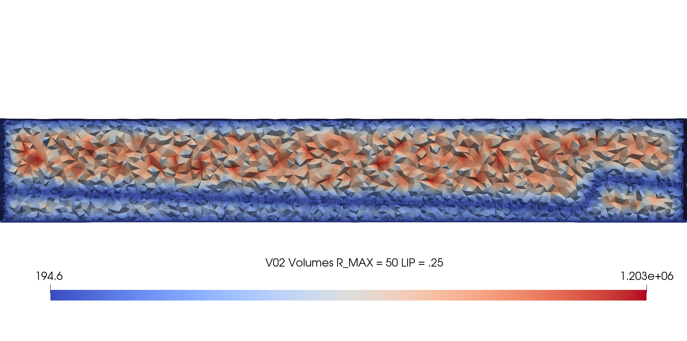
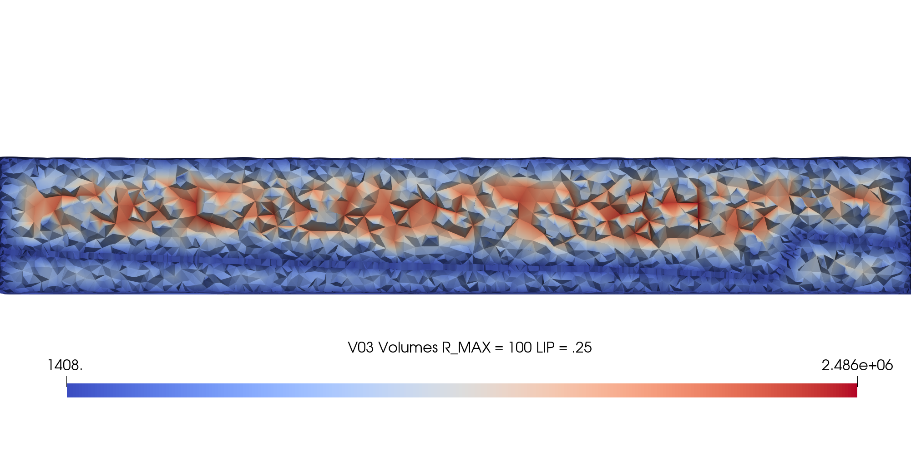
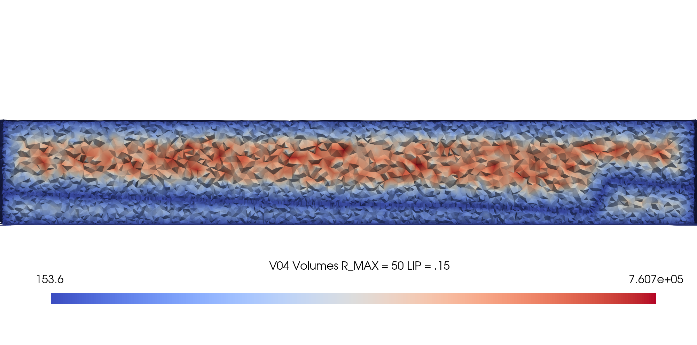
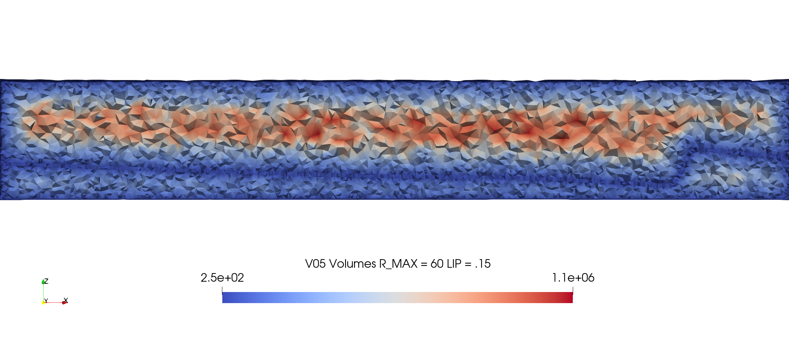
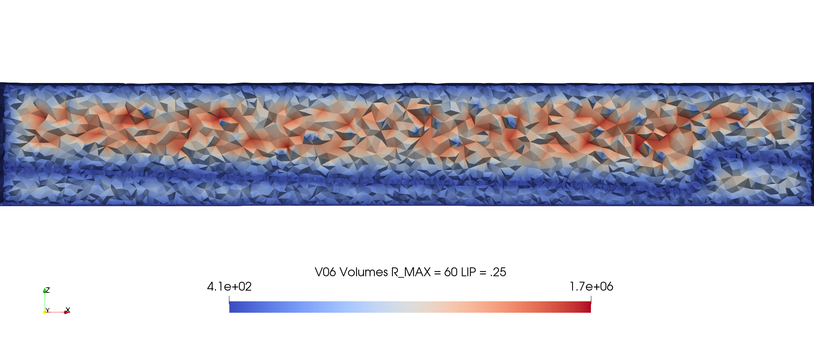
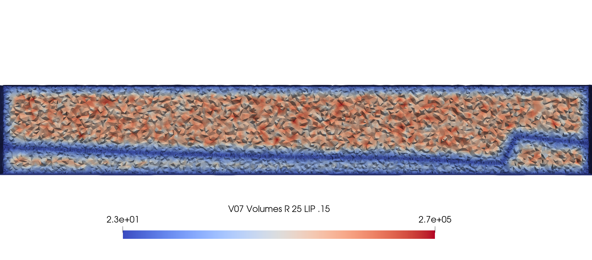

# GDSA Basin Example from JewelSuite 2020

```
Vers    Parameters         Cells   Min  Volume	Max Volume
0	Tet 50x20	   103950  6250	        50000
1	R=10000  LIP=.25   15751   1872	        3610362
2	R=50     LIP=.25   76000   180	        1203425
3	R=100    LIP=.25   24967   1408	        2486226
4	R=50     LIP=.15   108134  153	        760714
7	R=25     LIP=.15   318343  22	        269455
```


V01_R10000_L25

<width="500" src="images/vc_V01_R10000_L25_clip.png"> 


V02_R50_L25

 


V03_R100_L25 (PFLOTRAN Simulations)

 


V04_R50_L15

 


V05_R60_L15

 


V06_R60_L25




V07_R25_L15

 


