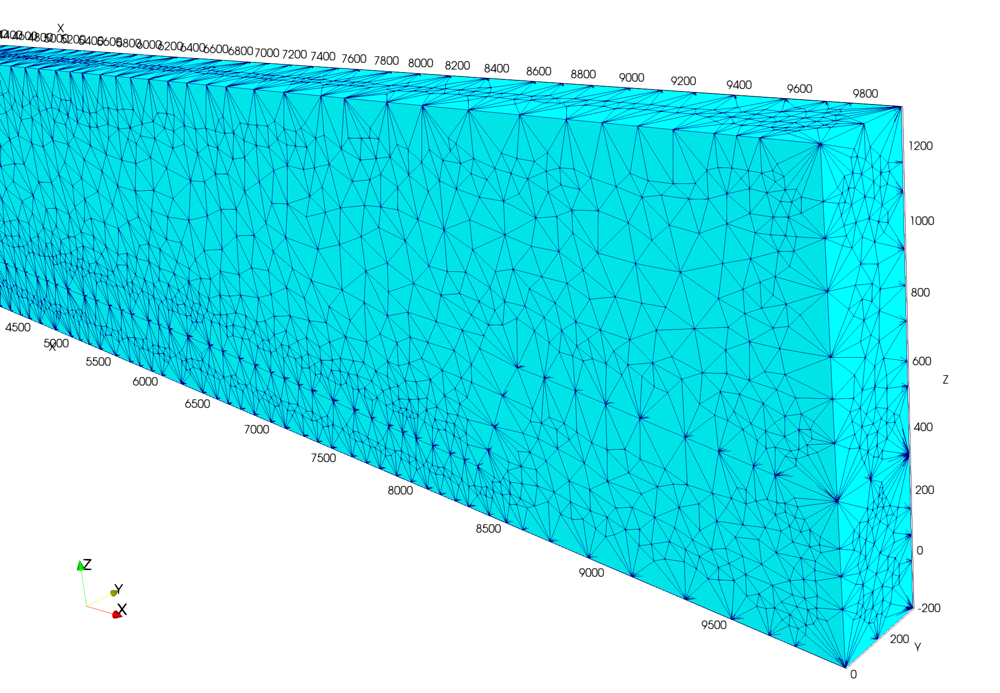
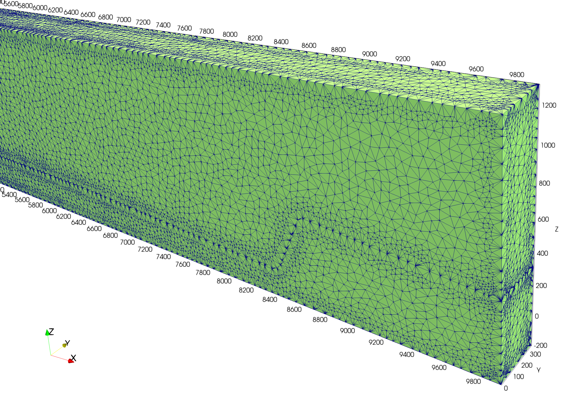
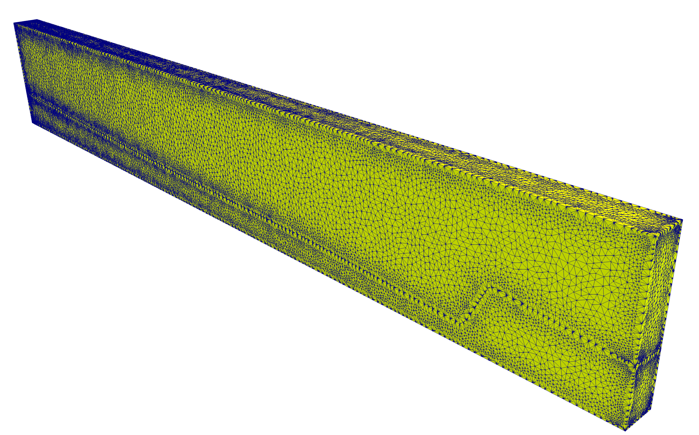
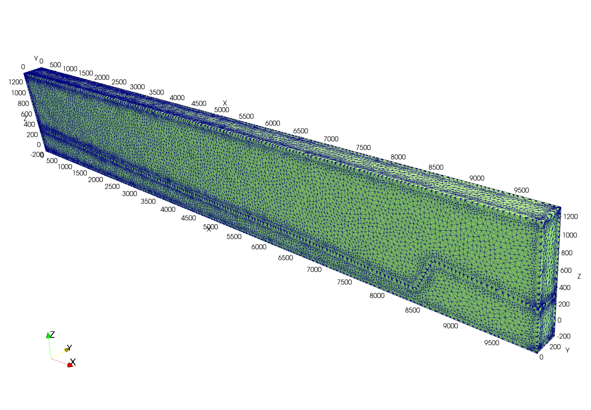
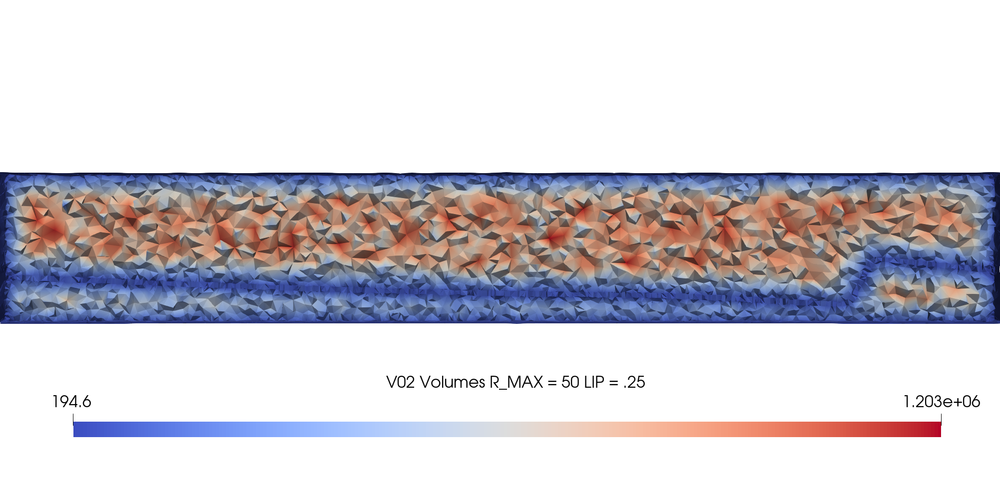
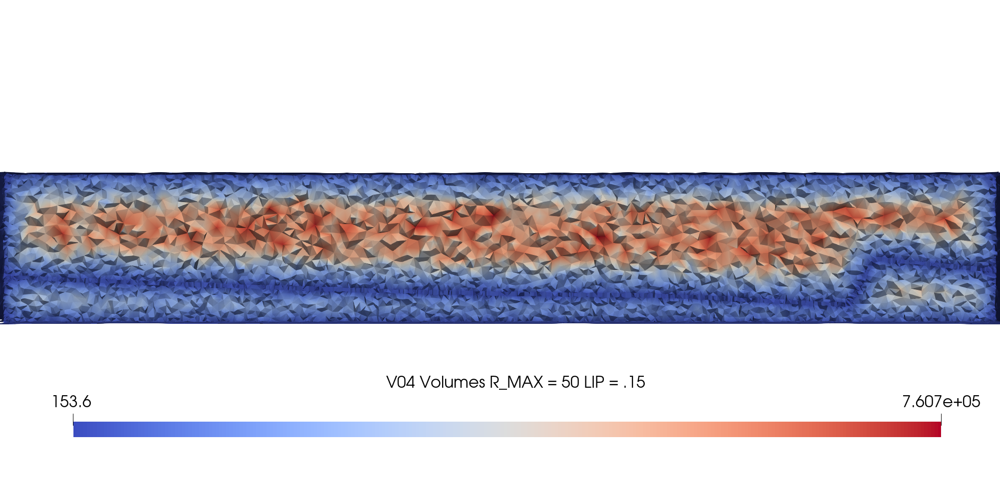

# Image Gallery 

Gallery written: Tue Aug 18 15:45:37 2020

Image Directory: /project/eesdev/tam/clone/VoroCrust/GDSA_basin/images

|  |  |  |   | 
| :---: | :---: | :---: | :---:  | 
|  |  |  |   | 
|  **vc_flat_Rmax_10000_fault** |  **vc_flat_Rmax_10000** |  **vc_flat_Rmax_100_fault** |  **vc_flat_Rmax_100**  | 
|  |  |  |   | 
|  **vc_flat_Rmax_50_fault** |  **vc_flat_Rmax_50L15** |  **vc_flat_Rmax_50** |  **vc_reg02_fault**  | 
|  |  |  |   | 
|  **vc_regions_fault** |  **vc_V01_R10000_L25_clip** |  **vc_V02_R50_L25_clip** |  **vc_V03_R100_L25_clip**  | 
|  |  |  |   | 
|  **vc_V04_R50_L15_clip**  | 
|   | 

End Gallery
