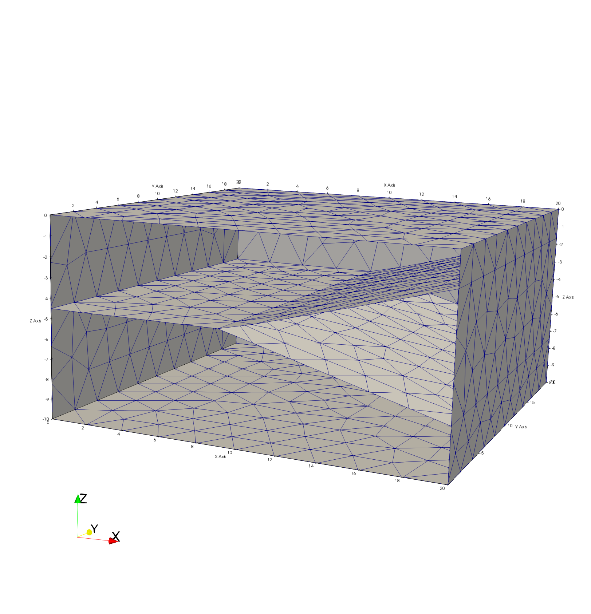
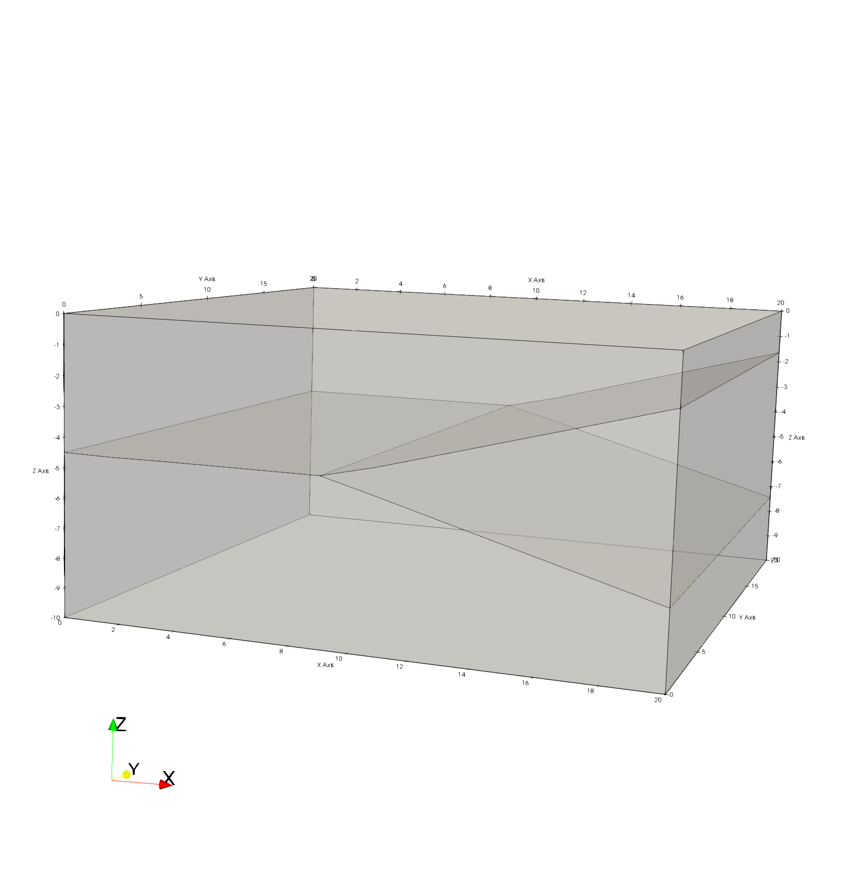
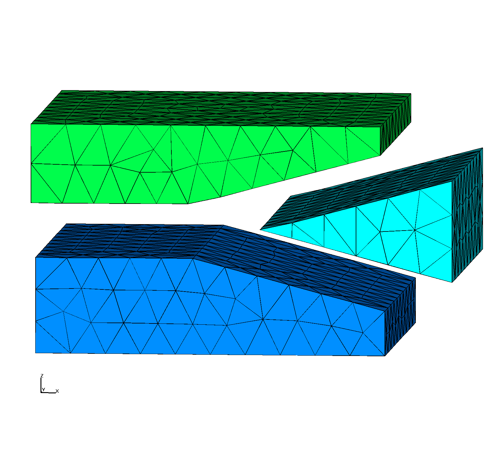
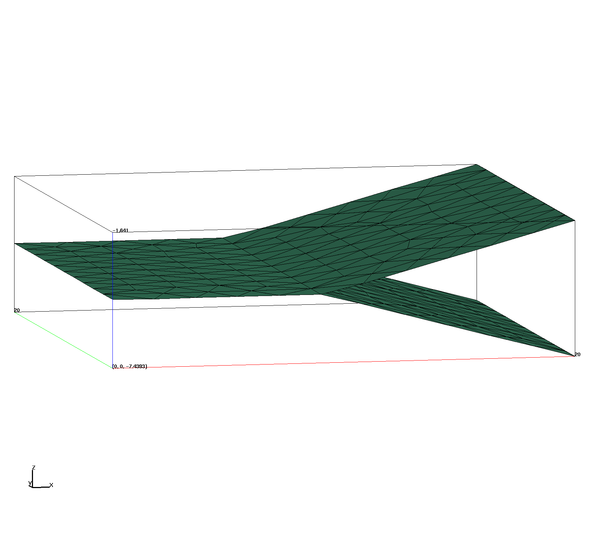
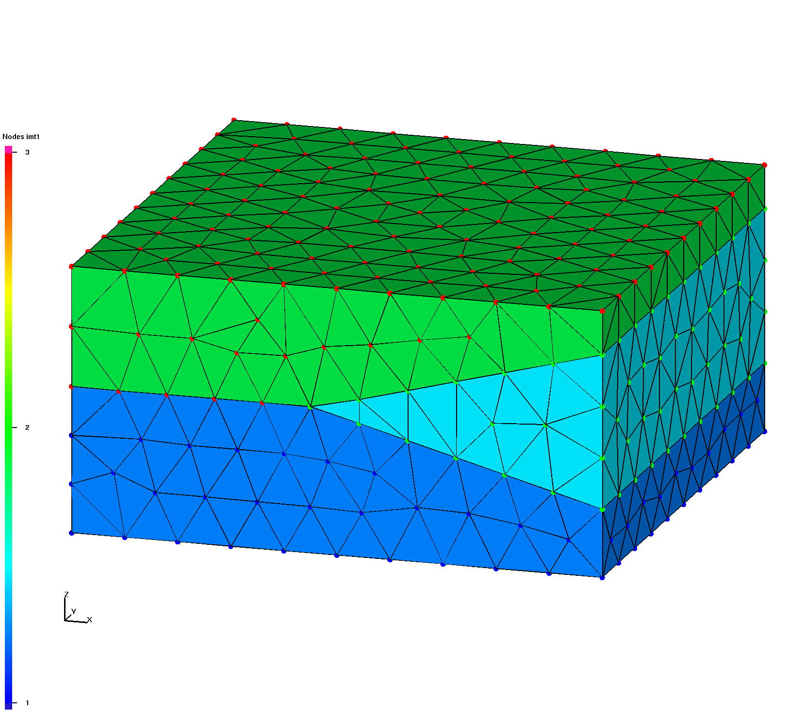
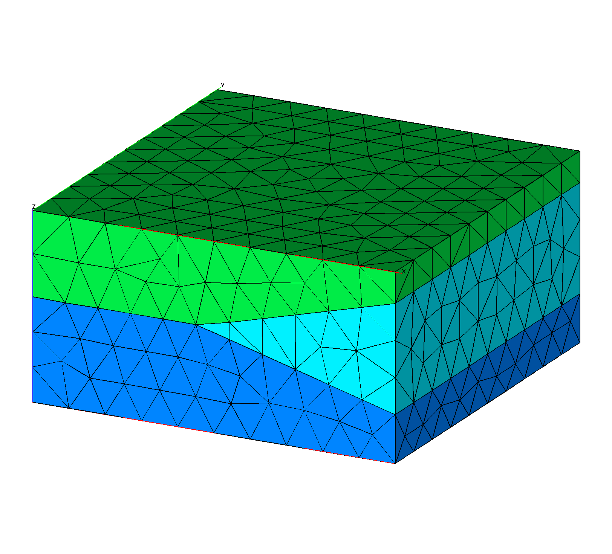
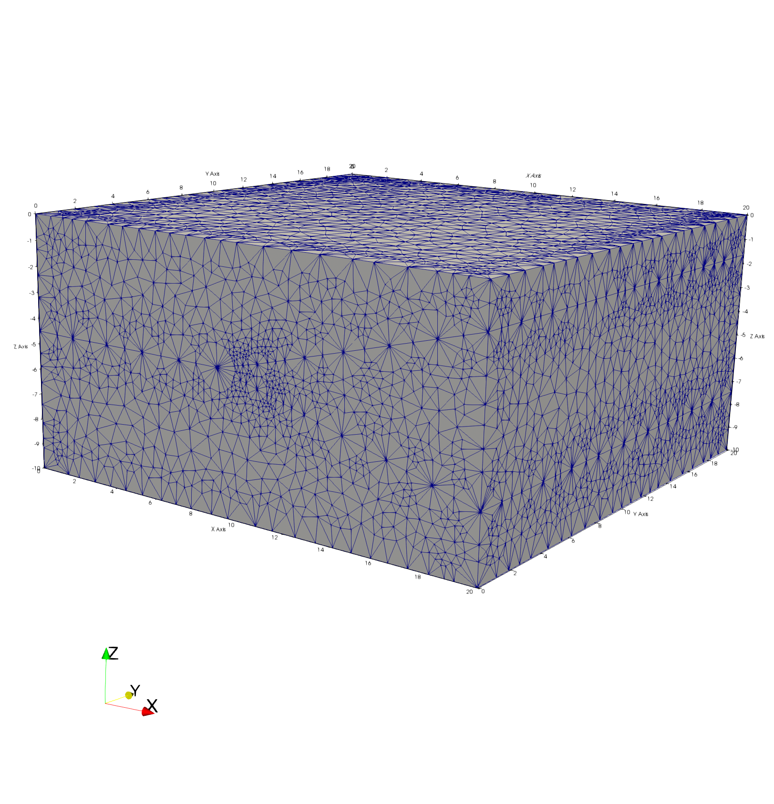
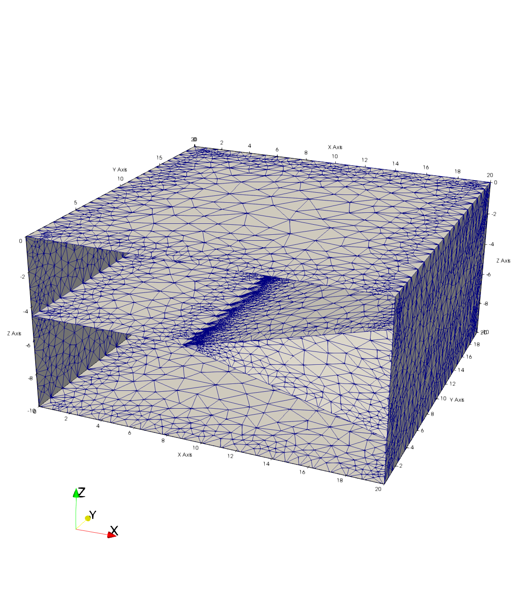
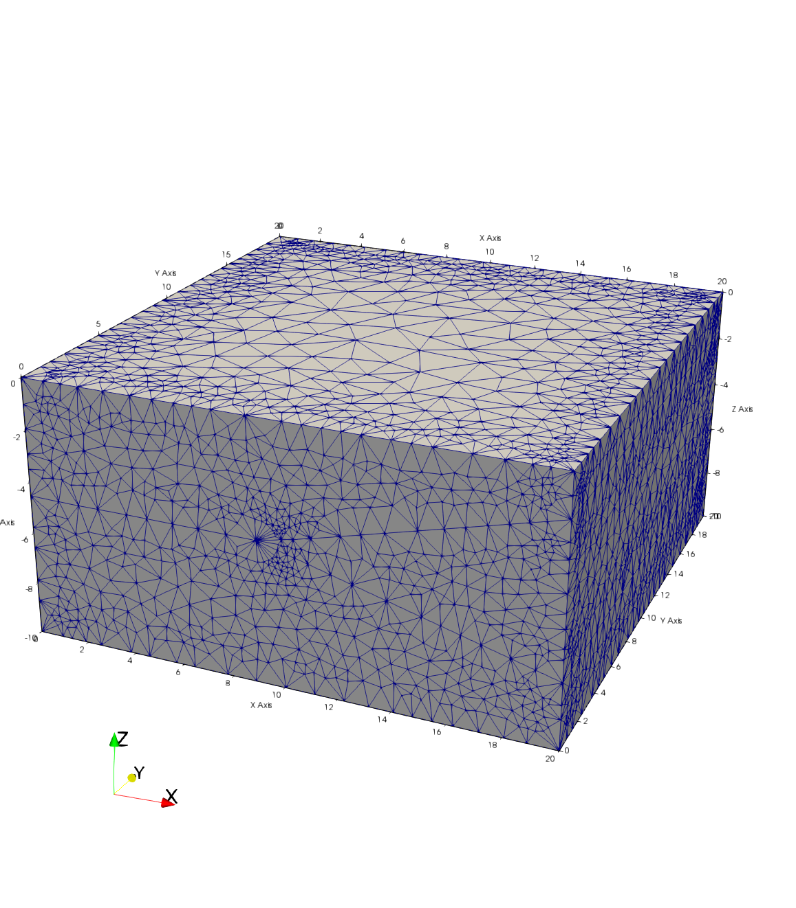

# Image Gallery 

Gallery written: Tue Jul  2 11:40:48 2019

Image Directory: /project/meshing/GEO_Integration/repos/vorocrust/examples_lanl/GDSA_Tests/Cube_Test02/images

|  |  |  |   | 
| :---: | :---: | :---: | :---:  | 
|  |  |  |   | 
|  **T2_surfmesh_all_clip** |  **T2_surfmesh_all** |  **T2_tet_gfm_ex** |  **T2_tet_gfm_intrf**  | 
|  |  |  |   | 
|  **T2_tet_gfm_nodes** |  **T2_tet_gfm** |  **T2_vorocrust_non_manifold_off** |  **T2_vorocrust_surfmesh_clip**  | 
|  |  |  |   | 
|  **T2_vorocrust_surfmesh**  | 
|   | 

End Gallery 
