# Image Gallery 

Gallery written: Tue Jul  2 11:40:18 2019

Image Directory: /project/meshing/GEO_Integration/repos/vorocrust/examples_lanl/GDSA_Tests/Cube_Test03/images

|  |  |  |   | 
| :---: | :---: | :---: | :---:  | 
|  |  |  |   | 
|  **T3_surfmesh_gfm_clip** |  **T3_surfmesh_gfm** |  **T3_tet_gfm_ex** |  **T3_tet_gfm_intrf**  | 
| 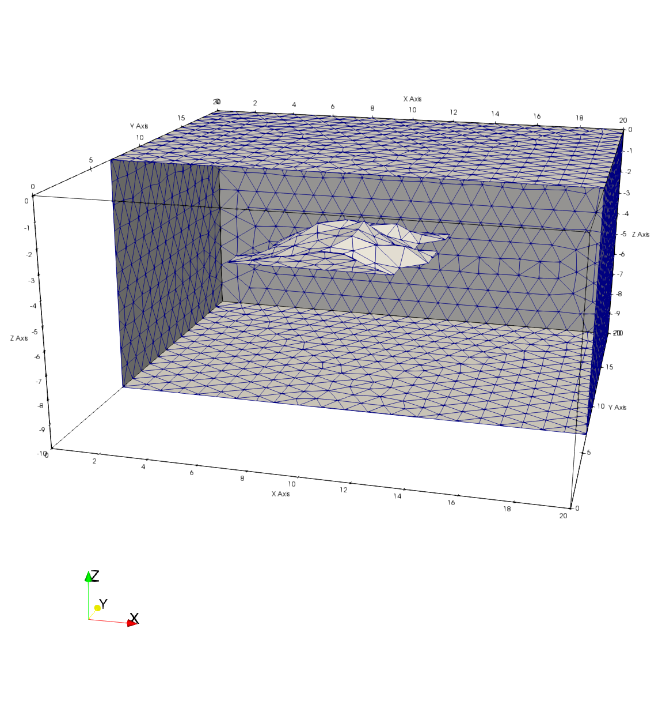 | 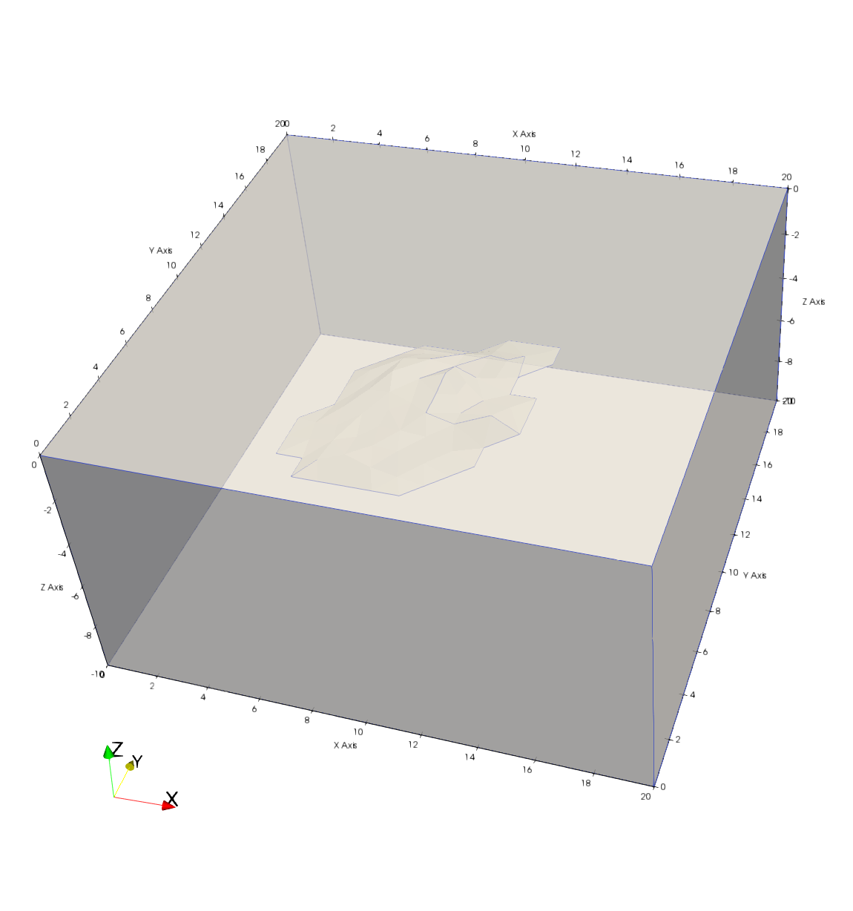 | 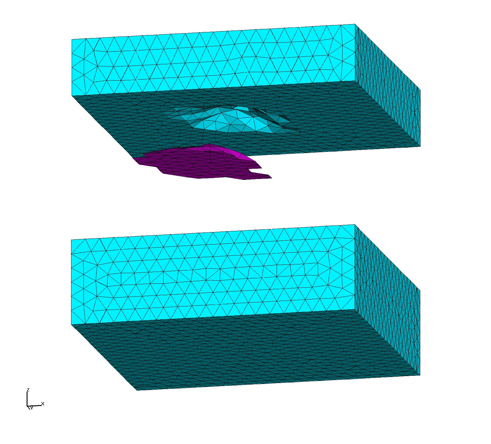 | 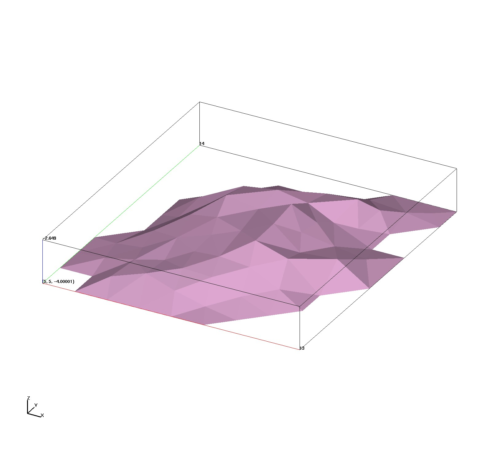  | 
|  **T3_tet_gfm** |  **T3_vorocrust_non_manifold_off_clip** |  **T3_vorocrust_non_manifold_off** |  **T3_vorocrust_surfmesh_R0.8_clip**  | 
| 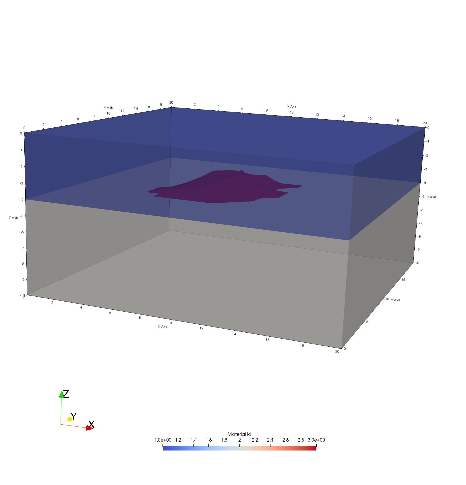 | 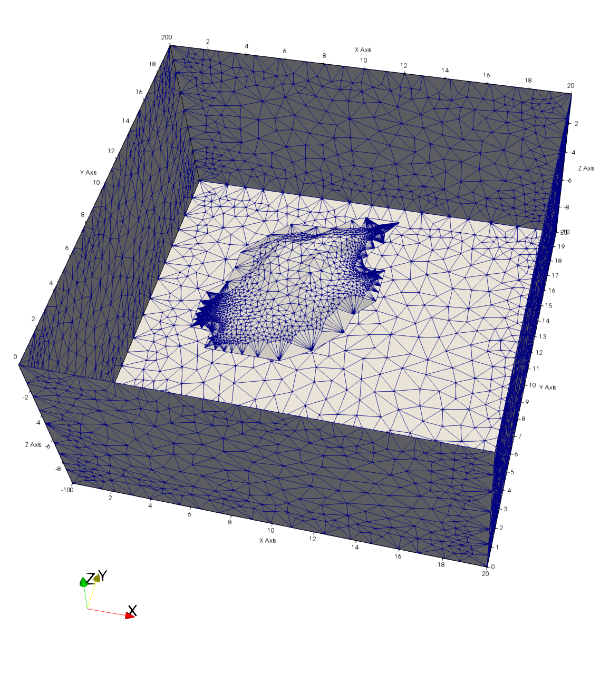 | 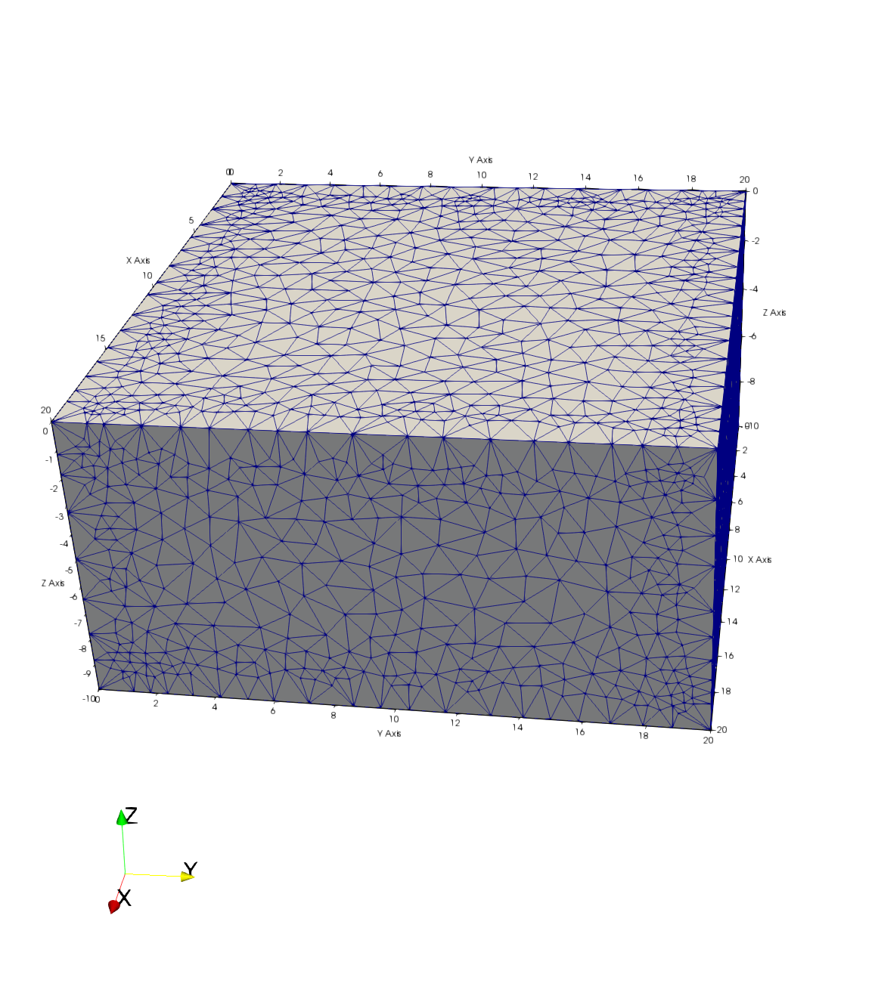 | 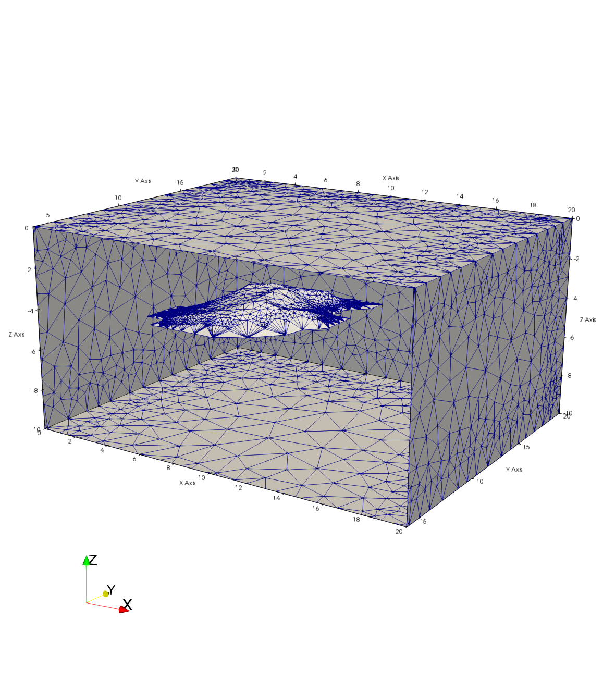  | 
|  **T3_vorocrust_surfmesh_R0.8** |  **T3_vorocrust_surfmesh_R1000_clip** |  **T3_vorocrust_surfmesh_R1000**  | 
| 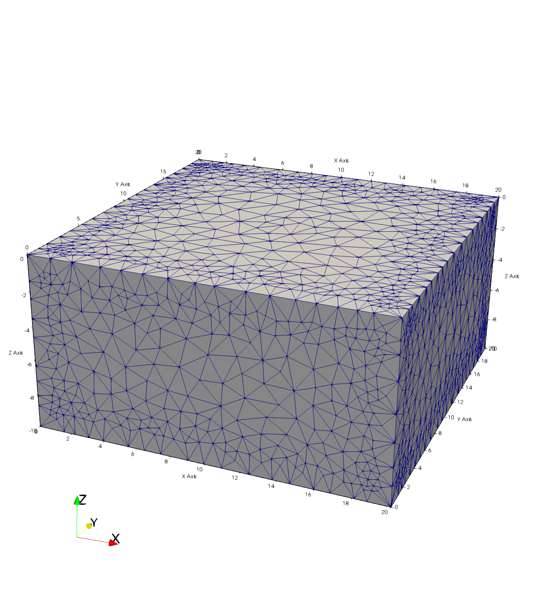 | 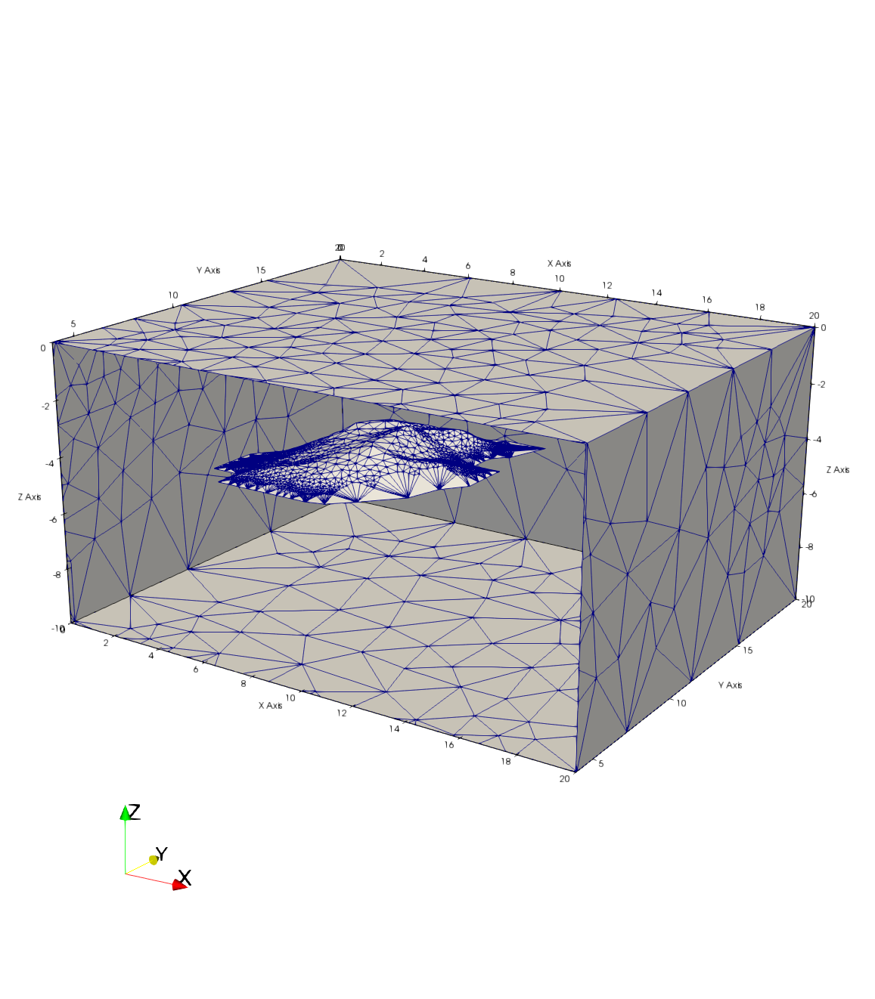 | 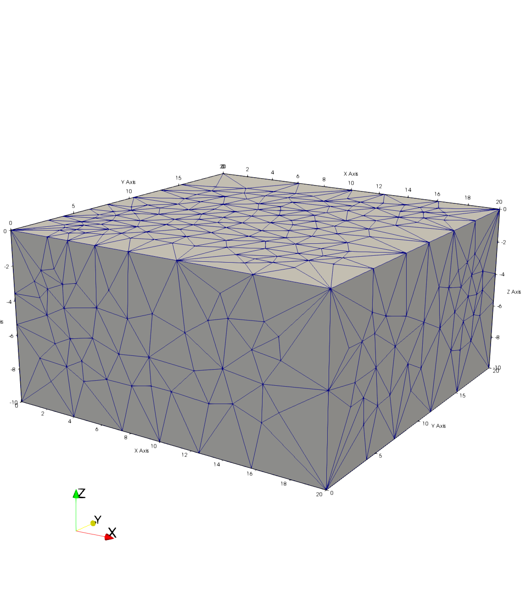  | 

End Gallery 
