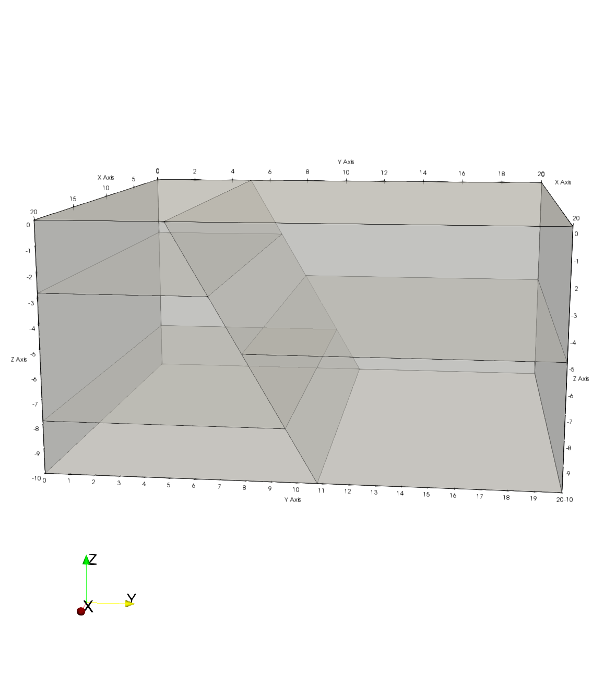
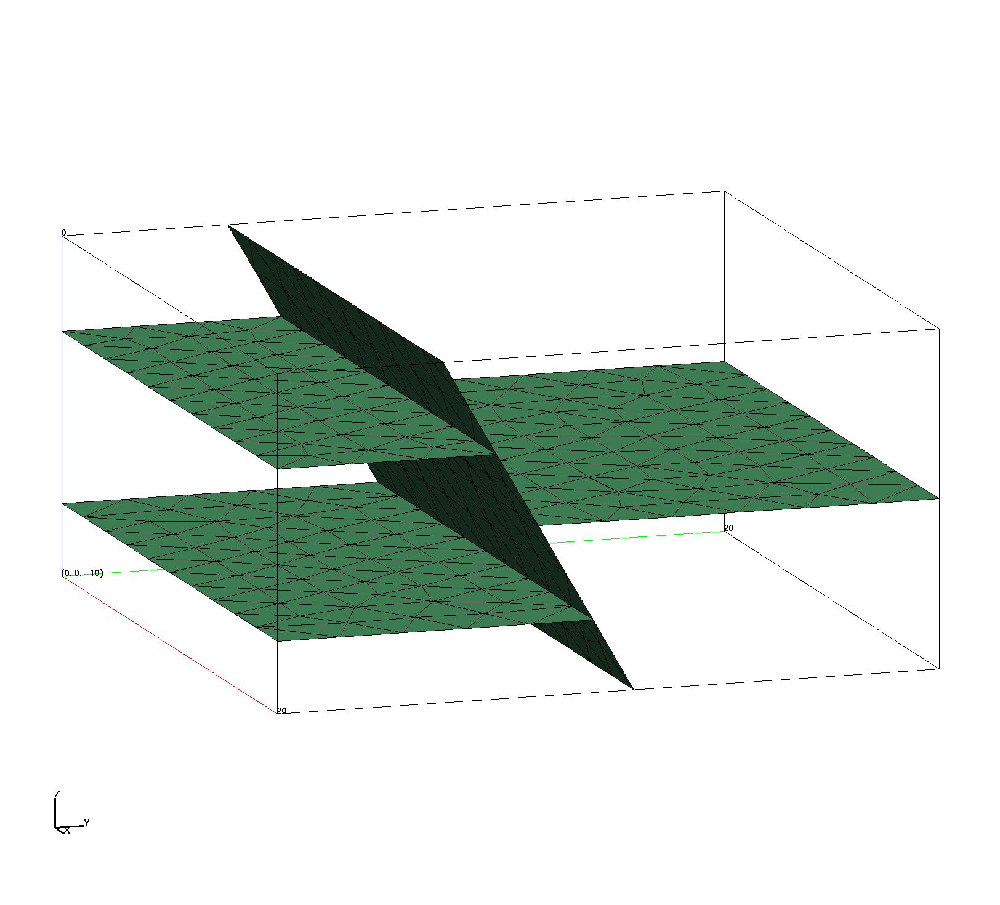
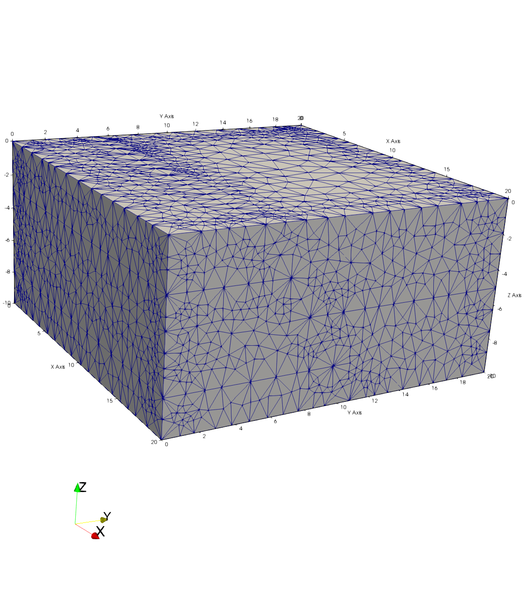
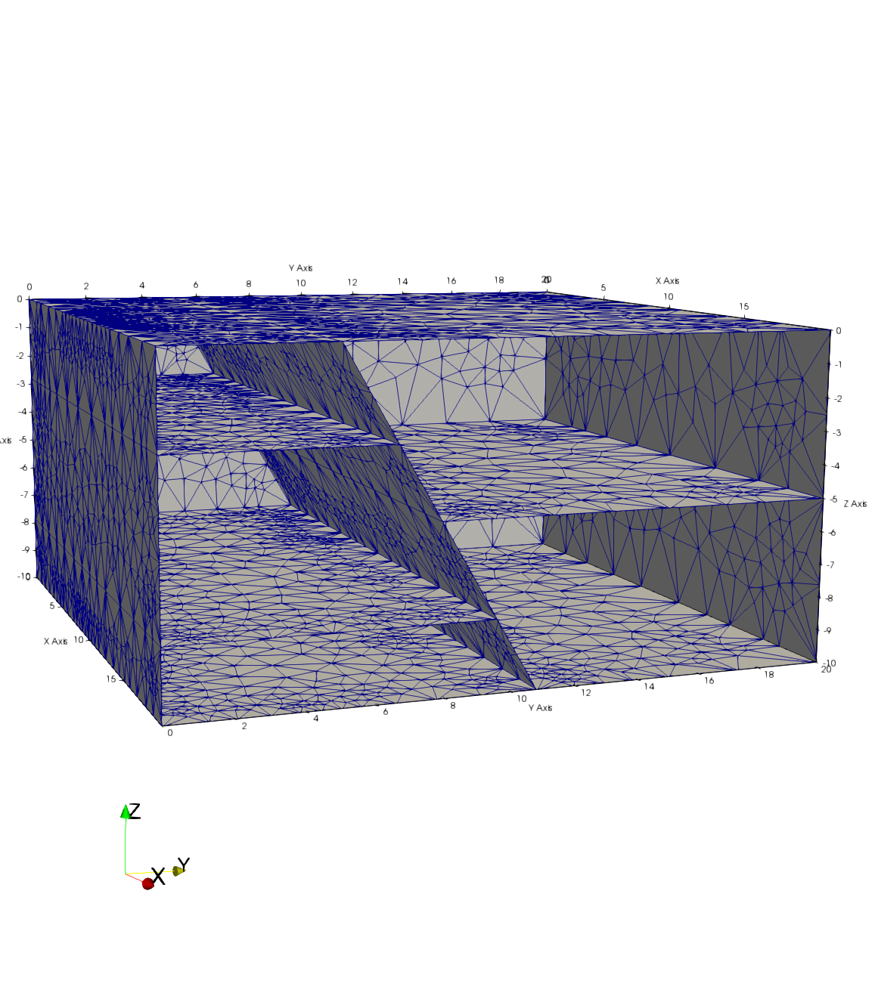

# Image Gallery 

Gallery written: Tue Jul  2 11:40:03 2019

Image Directory: /project/meshing/GEO_Integration/repos/vorocrust/examples_lanl/GDSA_Tests/Cube_Test04/images

|  |  |  |   | 
| :---: | :---: | :---: | :---:  | 
|  |  |  |   | 
|  **T4_surfmesh_gfm_clip** |  **T4_surfmesh_gfm** |  **T4_tet_gfm_5mat_ex** |  **T4_tet_gfm_5mat**  | 
|  |  |  |   | 
|  **T4_tet_gfm_intrf** |  **T4_vorocrust_surfmesh_R1_clip** |  **T4_vorocrust_surfmesh_R1** |  **T4_vorocrust_surfmesh_R2_clip**  | 
|  |  |  |   | 
|  **T4_vorocrust_surfmesh_R2**  | 
|   | 

End Gallery 
