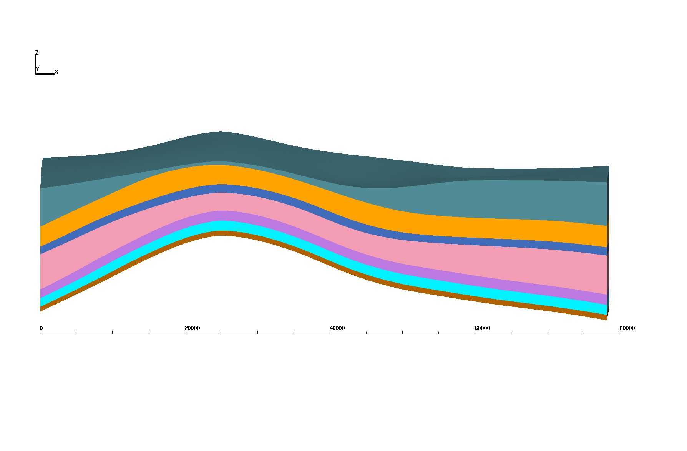
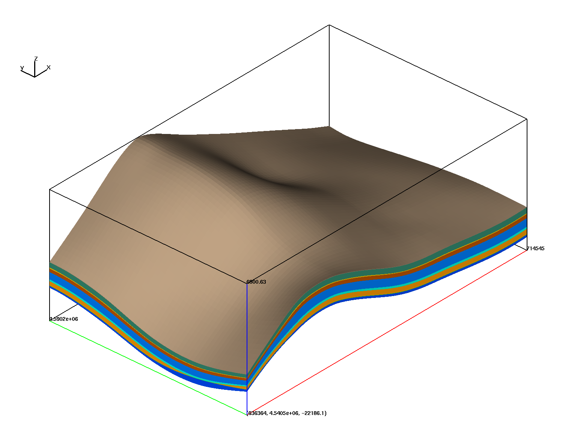
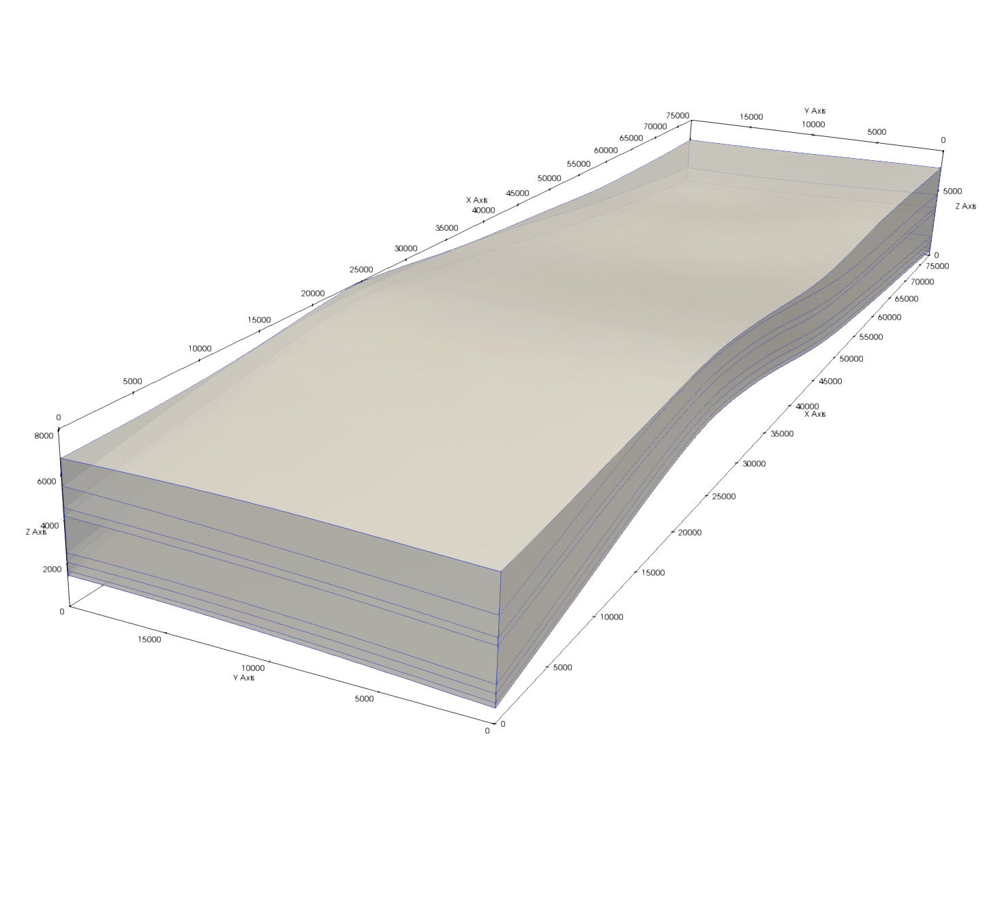
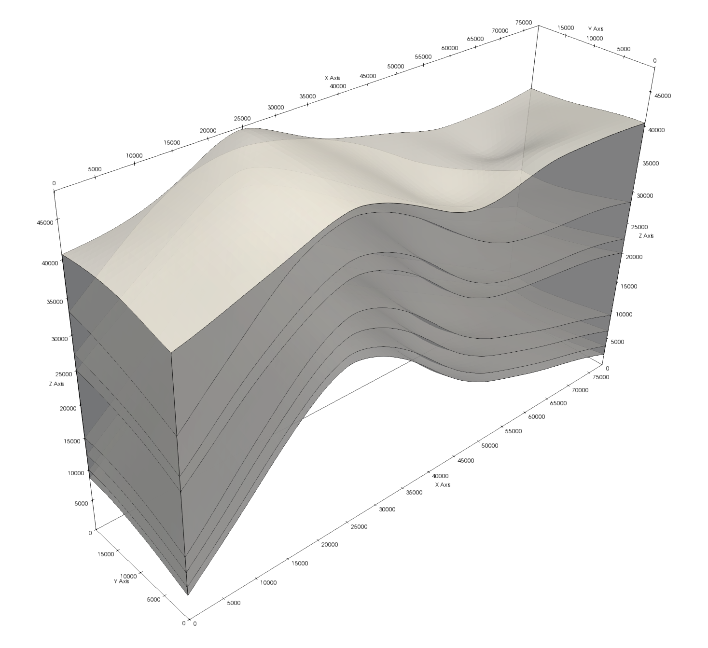
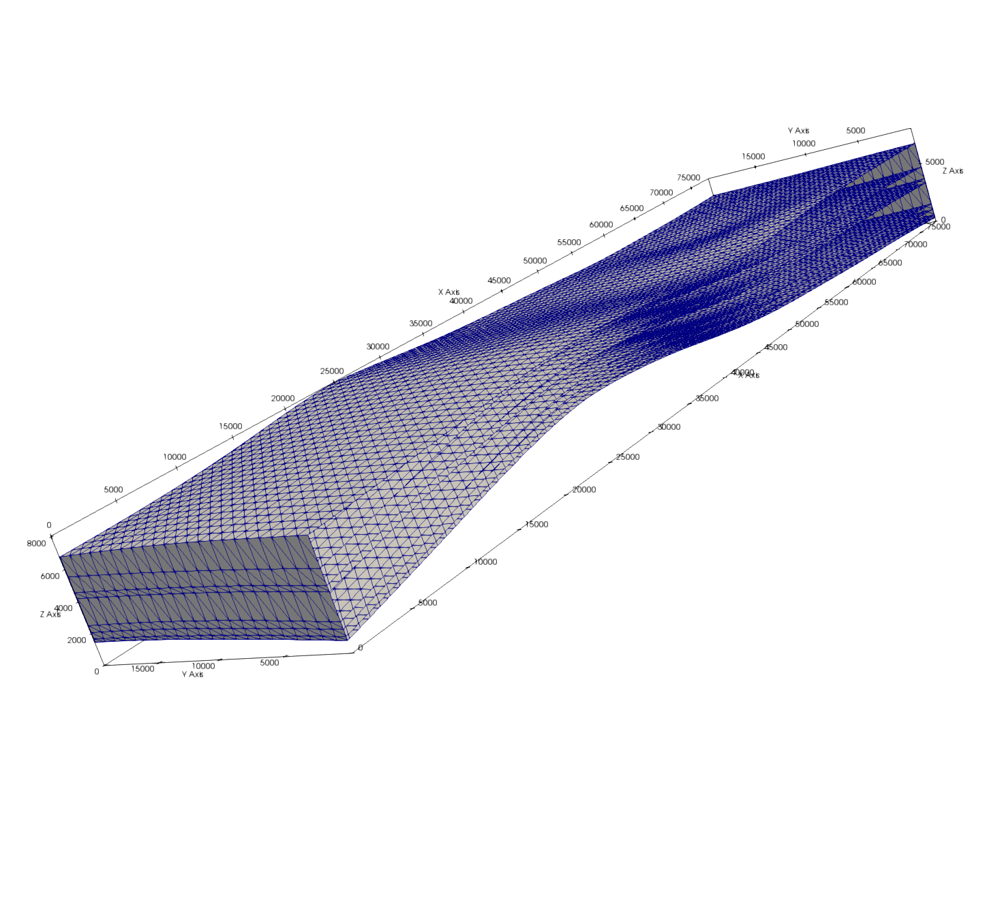
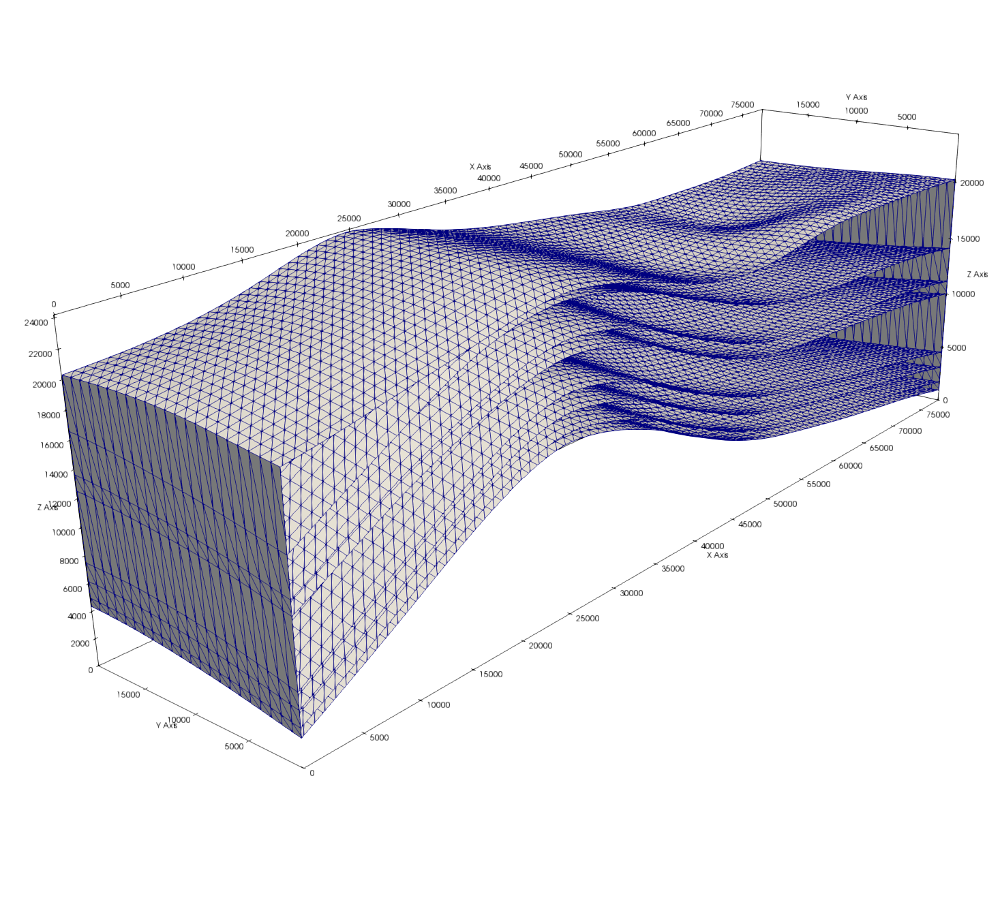
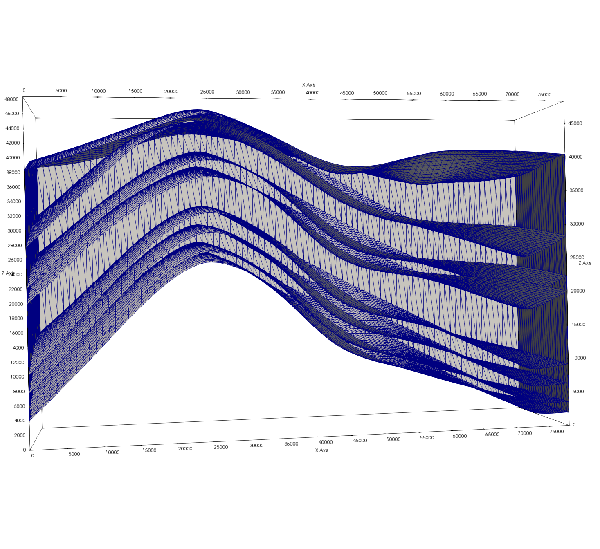
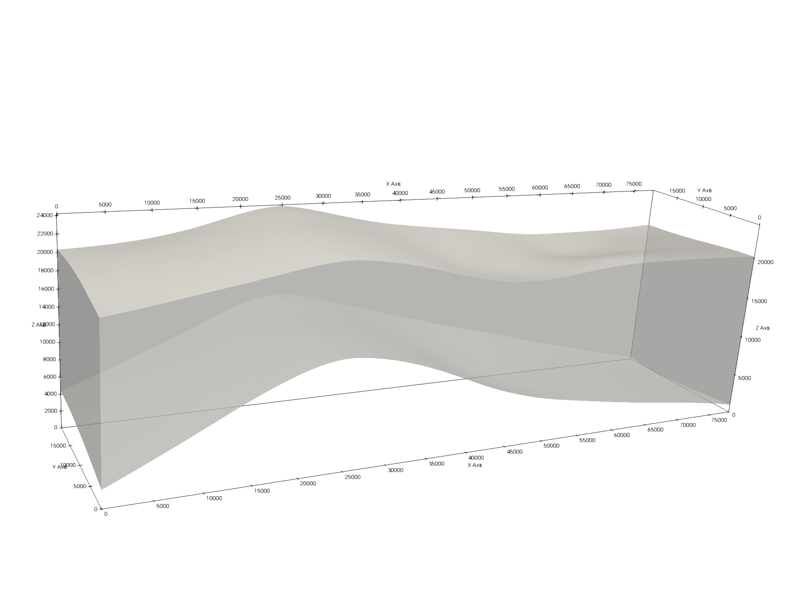
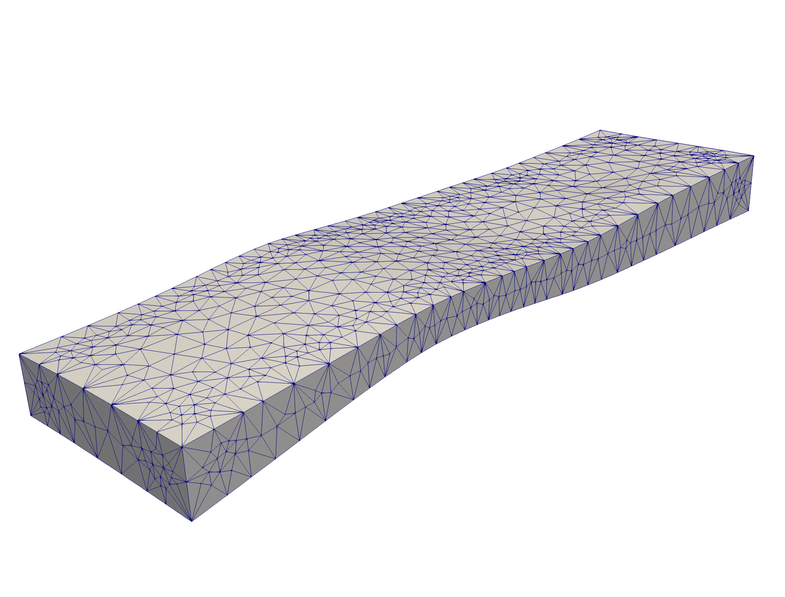
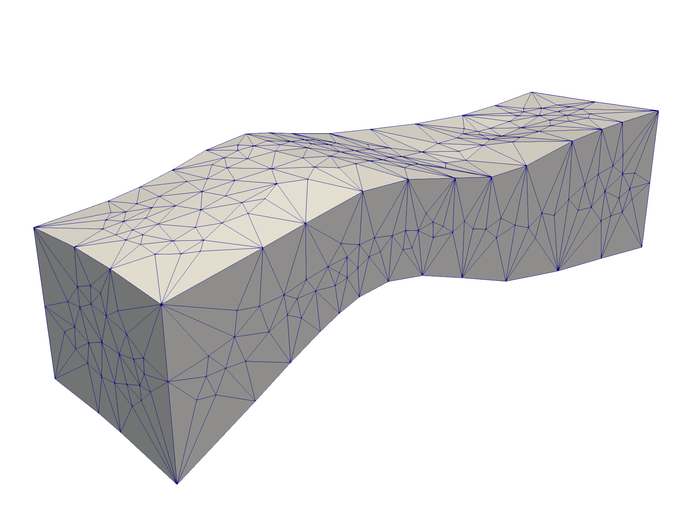

# Image Gallery 

Gallery written: Tue Jul  9 11:41:06 2019

Image Directory: /project/meshing/GEO_Integration/repos/vorocrust/examples_lanl/Slope_Tests/uplift_slopes/images

|  |  |   | 
| :---: | :---: | :---:  | 
|  |  |   | 
|  **GFM_B2_sub7_1x** |  **GFM_B2_sub7_3x** |  **GFM_B2_sub7_6x**  | 
|  |  |   | 
|  **GFM_EVRSU08_Scut** |  **GFM_EVsurfs_B2** |  **surf_gfm_7lay_3x**  | 
|  |  |   | 
|  **surf_gfm_layers_1x** |  **surf_gfm_layers_3x** |  **surf_gfm_layers_6x**  | 
|  |  |   | 
|  **surf_gfm_layers_li_1x** |  **surf_gfm_layers_li_3x** |  **surf_gfm_layers_li_6x**  | 
|  |  |   | 
|  **surf_gfm_shell_1x** |  **surf_gfm_shell_3x** |  **surf_gfm_shell_6x**  | 
|  |  |   | 
|  **surf_gfm_shell_li_1x** |  **surf_gfm_shell_li_3x** |  **surf_gfm_shell_li_6x**  | 
|  |  |   | 
|  **vc_p1_surf_shell_1x** |  **vc_p1_surf_shell_3x** |  **vc_p1_surf_shell_6x**  | 
|  |  |   | 

End Gallery
